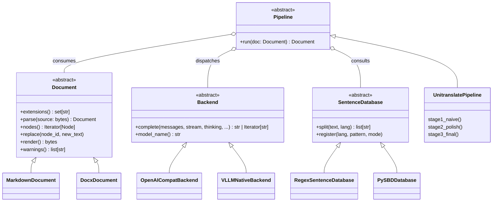

# unitranslate

[](https://www.gnu.org/licenses/agpl-3.0)
[](https://pypi.org/project/unitranslate/)
[](https://pypi.org/project/unitranslate/)

**Structure-preserving, multi-stage translation for any plain-text document.**

`unitranslate` parses a document into a concrete syntax tree, detects its
language and encoding, and translates it through a three-stage pipeline
(naive → per-node polish → full-context polish). It is designed so that
**document formats** and **inference backends** are both pluggable, letting
you compose your own translation solution the same way Pandoc composes
readers and writers.

---

## Table of contents

- [Why unitranslate?](#why-unitranslate)
- [Install](#install)
- [Quick start](#quick-start)
- [The three-stage pipeline](#the-three-stage-pipeline)
- [Architecture](#architecture)
- [The four abstractions](#the-four-abstractions)
  - [Document](#document)
  - [Backend](#backend)
  - [Pipeline](#pipeline)
  - [SentenceDatabase](#sentencedatabase)
- [Extending unitranslate](#extending-unitranslate)
  - [Adding a document format](#adding-a-document-format)
  - [Adding a backend](#adding-a-backend)
  - [Adding sentence rules](#adding-sentence-rules)
- [Project layout](#project-layout)
- [Development](#development)
- [License](#license)

---

## Why unitranslate?

Machine translation APIs destroy document structure: headings become
paragraphs, code fences get translated, tables lose their alignment.
LLMs can translate prose beautifully but cannot be trusted to keep your
Markdown byte-for-byte intact when you send the whole document in one
shot.

`unitranslate` solves this by **separating structure from content**:

1. A parser (tree-sitter) produces a concrete syntax tree at the byte level.
2. Every translatable node is translated *individually* — the tree is
   never asked to guess where a paragraph ends.
3. A final pass reassembles the translated nodes back into the tree,
   guaranteeing the output has the **same structure as the input**.

Because the content layer only ever sees plain text, the same pipeline
works for Markdown, reStructuredText, LaTeX, and — with a small adapter —
DOCX, PPTX, and XLSX (which are just zipped XML documents).

---

## Install

```bash
# with uv
uv add unitranslate

# with pip
pip install unitranslate
```

`unitranslate` requires Python ≥ 3.10.

For the local-vLLM backend:

```bash
pip install "unitranslate[vllm]"
```

---

## Quick start

The default backend targets a local **Ollama** server through the OpenAI
SDK. The latest downloaded model is selected automatically.

```bash
# translate README.md into Chinese, auto-detecting the source language
unitranslate README.md --target zh
```

```bash
# use an explicit model on a vLLM HTTP server
unitranslate paper.md --target ja \
    --backend openai \
    --base-url http://localhost:8000/v1 \
    --api-key EMPTY \
    --model Qwen/Qwen2.5-7B-Instruct
```

```bash
# load a HuggingFace model directly with vLLM (no server needed)
unitranslate report.md --target de \
    --backend vllm \
    --model meta-llama/Llama-3.1-8B-Instruct \
    --tp 2
```

Or compose the pieces yourself in Python:

```python
from pathlib import Path
from unitranslate.documents import MarkdownDocument
from unitranslate.backends import OpenAICompatBackend
from unitranslate.pipeline import Pipeline
from unitranslate.sentence import SentenceDatabase

backend = OpenAICompatBackend(base_url="http://localhost:11434/v1/")
doc     = MarkdownDocument.parse(Path("README.md").read_bytes())
db      = SentenceDatabase.default()

pipeline = Pipeline(backend=backend, sentence_db=db, target="zh")
result   = pipeline.run(doc)

Path("README.zh.md").write_bytes(result.render())
```

---

## The three-stage pipeline

`unitranslate` never asks a single model call to do everything. Instead it
stages the work so that cheap decisions stay cheap and expensive calls get
only the content that actually needs them.

### Stage 1 — Naive translation

Every sentence becomes one task. Tasks are dispatched to the backend through
a thread pool. **Thinking is disabled** for this stage; the model is asked
for plain text only. A `tqdm` progress bar reports progress in sentences.

The result is a *complete but unpolished* document — every node already has
a translation, structure already matches the input.

### Stage 2 — Node polishing

Each translatable node is re-sent to the model **one at a time**, with
**thinking enabled** and tokens streamed to the terminal. The model is
asked to decide whether the naive translation needs work:

```xml
<polish required="false"/>
```

or

```xml
<polish required="true">…polished text…</polish>
```

A SAX parser reads the stream incrementally and **stops the model as soon
as `required="false"` is seen**, saving computation on trivial nodes.

### Stage 3 — Full-context polish

The stage-2 document is placed into the context window in its entirety and
the model returns a final polished Markdown document in one streaming pass.
This is where cross-sentence coherence, terminology consistency, and
document-level tone are resolved. The result is saved verbatim.

---

## Architecture



The design is deliberately minimal. `Pipeline` is the only class that
knows about *all three* of the others, and even it does not require
concrete implementations — every collaboration is against the abstract
interface.

---

## The four abstractions

### Document

A `Document` knows how to parse a byte stream into a tree of translatable
`Node`s, how to replace the text of one node without disturbing the rest,
and how to serialize back to bytes.

```python
class Document(Protocol):
    @classmethod
    def extensions(cls) -> set[str]: ...
    @classmethod
    def parse(cls, source: bytes) -> "Document": ...
    def nodes(self) -> Iterator[Node]: ...
    def replace(self, node_id: str, new_text: str) -> None: ...
    def render(self) -> bytes: ...
    def warnings(self) -> list[str]: ...
```

Because `replace` operates on byte offsets, only the nodes you actually
translate are re-encoded. Everything else — whitespace, front-matter,
comments, code blocks — is preserved bit-for-bit.

### Backend

A `Backend` is anything that can answer chat-completion requests. The
protocol is intentionally narrow: one method, one set of keyword arguments.

```python
class Backend(Protocol):
    def complete(
        self,
        messages: Sequence[dict],
        *,
        stream: bool = False,
        temperature: float = 0.2,
        thinking: bool | None = None,
        max_tokens: int | None = None,
        stop: list[str] | None = None,
    ) -> str | Iterator[str]: ...

    def model_name(self) -> str: ...
```

Two implementations ship in the box:

| Backend | Target |
|---|---|
| `OpenAICompatBackend` | Ollama, vLLM HTTP, SGLang, LiteLLM, llama.cpp server — anything speaking the OpenAI chat API |
| `VLLMNativeBackend` | In-process vLLM `LLM` for offline batched inference from a HuggingFace model |

### SentenceDatabase

A `SentenceDatabase` maps a language code to a splitting strategy. The
default implementation is a dict of pre-compiled regexes; alternative
implementations wrap `pysbd` or `blingfire` for higher accuracy or speed.

```python
class SentenceDatabase(Protocol):
    def split(self, text: str, lang: str) -> list[str]: ...
    def register(self, lang: str, pattern: re.Pattern, mode: str) -> None: ...
```

### Pipeline

A `Pipeline` composes a `Document`, a `Backend`, and a `SentenceDatabase`
into a translation strategy. The default `UnitranslatePipeline` implements
the three-stage flow described above, but nothing stops you from writing a
single-stage pipeline that skips polishing entirely.

```python
class Pipeline(Protocol):
    def run(self, doc: Document) -> Document: ...
```

---

## Extending unitranslate

### Adding a document format

Subclass `Document` and register it. DOCX, PPTX, and XLSX are all ZIP
archives of XML; you can parse the inner XML with `lxml` and reuse the
SAX utilities from `unitranslate.utils.xmlstream`.

```python
from unitranslate.documents import Document, Node
from unitranslate.documents.registry import register

@register
class DocxDocument(Document):
    @classmethod
    def extensions(cls) -> set[str]:
        return {".docx"}

    @classmethod
    def parse(cls, source: bytes) -> "DocxDocument":
        ...

    def nodes(self):
        ...

    def replace(self, node_id, new_text):
        ...

    def render(self) -> bytes:
        ...

    def warnings(self) -> list[str]:
        return []
```

That is all the rest of the pipeline needs. `Pipeline.run()` does not care
whether it is looking at Markdown or a spreadsheet.

### Adding a backend

If your inference server speaks the OpenAI chat API — and almost all of
them do — you do not need a new class. Just point `OpenAICompatBackend` at
the right URL:

```python
from unitranslate.backends import OpenAICompatBackend

backend = OpenAICompatBackend(
    base_url="http://localhost:8080/v1",   # llama.cpp server
    api_key="not-needed",
    model="qwen2.5-7b-instruct",
)
```

If your server speaks something else, implement `Backend.complete()`.

### Adding sentence rules

```python
from unitranslate.sentence import SentenceDatabase

db = SentenceDatabase.default()
db.register(
    "el",                                  # Greek
    re.compile(r"(?<=[.!?·])\s+(?=[Α-ΩΆ-Ώ])"),
    mode="split",
)
```

Or swap in a different implementation entirely:

```python
from unitranslate.sentence import PySBDDatabase

pipeline = Pipeline(backend=backend, sentence_db=PySBDDatabase(), target="fr")
```

---

## Project layout

This project was scaffolded with `uv init --package` and follows the
standard `src/` layout.

```
unitranslate/
├── pyproject.toml
├── README.md
├── LICENSE                       # AGPL-3.0
├── src/
│   └── unitranslate/
│       ├── __init__.py
│       ├── py.typed
│       ├── cli.py                # `unitranslate` entry point
│       ├── pipeline.py
│       ├── documents/
│       │   ├── __init__.py
│       │   ├── base.py           # Document, Node
│       │   ├── registry.py       # extension → Document class
│       │   └── markdown.py
│       ├── backends/
│       │   ├── __init__.py
│       │   ├── base.py           # Backend protocol
│       │   ├── openai_compat.py
│       │   └── vllm_native.py
│       ├── sentence/
│       │   ├── __init__.py
│       │   ├── base.py           # SentenceDatabase protocol
│       │   ├── database.py       # regex defaults
│       │   └── pysbd_db.py
│       ├── stages/
│       │   ├── __init__.py
│       │   ├── encode.py
│       │   ├── segment.py
│       │   ├── naive.py
│       │   ├── polish.py
│       │   └── final.py
│       └── utils/
│           ├── __init__.py
│           ├── progress.py
│           └── xmlstream.py      # SAX early-stop parser
└── tests/
    ├── test_markdown.py
    ├── test_sentence_db.py
    └── test_pipeline.py
```

---

## Development

```bash
git clone https://github.com/your-org/unitranslate
cd unitranslate
uv sync --all-extras
uv run pytest
```

The CLI is exposed via `[project.scripts]`:

```toml
[project.scripts]
unitranslate = "unitranslate.cli:main"
```

You can run it directly from the checkout:

```bash
uv run unitranslate README.md --target zh
```

---

## License

`unitranslate` is licensed under the **GNU Affero General Public License
v3.0**. See [LICENSE](LICENSE) for the full text.

If you run a modified version of this software as a network service, the
AGPL requires you to offer the corresponding source to your users.